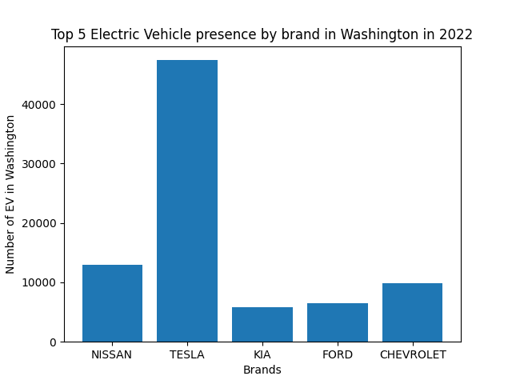

# Project 2 Submission: Visualizing Interesting Data Sets

This project was a result of the prompts listed [here](https://github.com/mikeizbicki/cmc-csci040/tree/2022fall/project_02). This will be my submission. 

**Plot 1**  
Top 5 EV Automobile Manufacturers in Washington

This bar graph shows the top 5 producers of electric vehicles (EV) in Washington last updated October 21st 2022. More specifically, this includes both battery EVs and plug-in hybrid EVs that are registered with the Washington Department of Licensing. I was interested to learn which automobile manufacturer would have the largest market share. I kind of expected Tesla to be the leader, but did not expect it to be so much more ahead of the other 4 competitors (Nissan, Kia, Ford, Chevrolet). This data comes from the [US Data Catalog](https://catalog.data.gov/dataset/electric-vehicle-population-data)

**Plot 2**
!
This data was taken from the GDP portion of the awesome-json-datasets.
