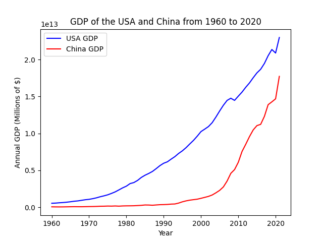

# Project 2 Submission: Visualizing Interesting Data Sets

This project was a result of the prompts listed [here](https://github.com/mikeizbicki/cmc-csci040/tree/2022fall/project_02). This will be my submission. 

**Plot 1: Top 5 EV Automobile Manufacturers in Washington**

This bar graph shows the top 5 producers of electric vehicles (EV) in Washington last updated October 21st 2022. More specifically, this includes both battery EVs and plug-in hybrid EVs that are registered with the Washington Department of Licensing. I was interested to learn which automobile manufacturer would have the largest market share. I expected Tesla to be the leader, but did not expect it to be so much more ahead of the other 4 competitors (Nissan, Kia, Ford, Chevrolet). This data comes from the [US Data Catalog](https://catalog.data.gov/dataset/electric-vehicle-population-data)

**Plot 2: US and China GDP over the years**

This is a line graph plot that shows GDP of both the United States of America and China from 1960 to 2020. After seeing  increasing tensions between both China and the US, namely with threats regarding Taiwan, I grew curious about the economies of these two countries, namely how close the GDP gap has become over the past few years. China has established itself as a global superpower, with a robust economy, so I wanted to plot this data to see just how much change in GDP had happened over the past decades. Surprisingly, there has been a considerable difference in GDP between the US and China over the past years, however the gap has definitely being bridged. The data for both the China and US GDP datasets come from the [awesome-json-datasets](https://github.com/jdorfman/awesome-json-datasets)

